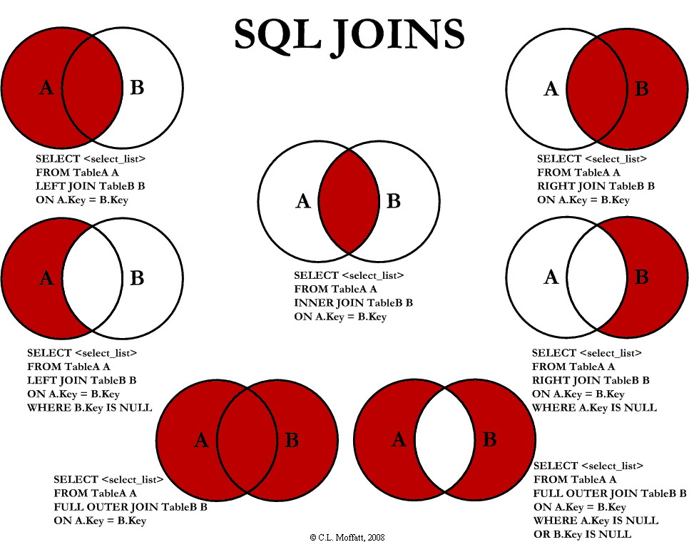

Trong quá trình làm việc với cơ sở dữ liệu quan hệ (RDBMS), việc kết hợp dữ liệu từ nhiều bảng là điều không thể tránh khỏi. Đó là lúc bạn cần đến **SQL JOIN**.

Tuy nhiên, nếu không nắm rõ từng loại `JOIN`, bạn dễ gặp lỗi logic, thiếu dữ liệu hoặc kết quả không như mong muốn.

Trong bài viết này, chúng ta sẽ cùng khám phá 4 loại `JOIN` phổ biến nhất trong SQL:

* `INNER JOIN`
* `LEFT JOIN`
* `RIGHT JOIN`
* `FULL OUTER JOIN`

Bằng cách sử dụng hình minh hoạ và ví dụ thực tế, bạn sẽ dễ dàng phân biệt chúng và biết khi nào nên dùng loại `JOIN` nào.

>**`JOIN` là câu lệnh dùng để kết hợp dữ liệu từ hai hoặc nhiều bảng dựa trên một điều kiện liên kết, thường là một khóa chung giữa các bảng.**

{: style="width: 100%; margin:24px 0"}

### 1. Tình huống minh họa thực tế
Hãy tưởng tượng bạn đang quản lý một hệ thống bán hàng, với hai bảng dữ liệu:  

Bảng `customers` – Danh sách khách hàng:

| <small>**customer_id**<small/> | <small>**name**<small/> | 
|----------------------|-------------------------------------|
| <small>1<small/> | <small>Lan<small/> |
| <small>2<small/> | <small>Hùng<small/> | 
| <small>3<small/> | <small>Mai<small/> | 
| <small>4<small/> | <small>An<small/> |
{: style="width:100%; margin-bottom:16px"}

Bảng `orders` – Danh sách đơn hàng:


| <small>**order_id**<small/> | <small>**customer_id**<small/> | <small>**product**<small/> |
|----------------------|-------------------------------------|---------------------------------------------------------------------|
| <small>101<small/> | <small>1<small/> | <small>Laptop<small/> | 
| <small>102<small/> | <small>2<small/> | <small>iPhone<small/> |
| <small>103<small/> | <small>1<small/> | <small>Bàn phím<small/> | 
| <small>104<small/> | <small>5<small/> | <small>Chuột<small/> |
{: style="width:100%; margin-bottom:16px"}

* `INNER JOIN` **- Lấy những bản ghi khớp ở cả hai bảng**
<div style='margin-top:16px'></div>

```
SELECT customers.name, orders.product
FROM customers
INNER JOIN orders ON customers.customer_id = orders.customer_id;
```

<div style='margin-bottom:16px'></div>

Kết quả:

| <small>**name**<small/> | <small>**product**<small/> | 
|----------------------|-------------------------------------|
| <small>Lan<small/> | <small>Laptop<small/> |
| <small>Lan<small/> | <small>Bàn phím<small/> | 
| <small>Hùng<small/> | <small>iPhone<small/> | 
{: style="width:100%; margin-bottom:16px"}

*🔍 Chỉ lấy những đơn hàng có khách hàng tồn tại và ngược lại. Bỏ qua dữ liệu không khớp.*

* `LEFT JOIN` **- Lấy toàn bộ dữ liệu từ bảng bên trái (customers)**

```
SELECT customers.name, orders.product
FROM customers
LEFT JOIN orders ON customers.customer_id = orders.customer_id;
```

<div style='margin-bottom:16px'></div>

Kết quả:

| <small>**name**<small/> | <small>**product**<small/> | 
|----------------------|-------------------------------------|
| <small>Lan<small/> | <small>Laptop<small/> |
| <small>Lan<small/> | <small>Bàn phím<small/> | 
| <small>Hùng<small/> | <small>iPhone<small/> | 
| <small>Mai<small/> | <small>NULL<small/> |
| <small>An<small/> | <small>NULL<small/> | 
{: style="width:100%; margin-bottom:16px"}

*🔍 Hiển thị toàn bộ khách hàng, dù có đơn hàng hay không. Các dòng không có đơn hàng sẽ được điền NULL.*

* `RIGHT JOIN` **- Lấy toàn bộ dữ liệu từ bảng bên phải (orders)**

```
SELECT customers.name, orders.product
FROM customers
RIGHT JOIN orders ON customers.customer_id = orders.customer_id;
```

<div style='margin-bottom:16px'></div>

Kết quả:

| <small>**name**<small/> | <small>**product**<small/> | 
|----------------------|-------------------------------------|
| <small>Lan<small/> | <small>Laptop<small/> |
| <small>Lan<small/> | <small>Bàn phím<small/> | 
| <small>Hùng<small/> | <small>iPhone<small/> | 
| <small>NULL<small/> | <small>Chuột<small/> |
{: style="width:100%; margin-bottom:16px"}

*🔍 Hiển thị toàn bộ đơn hàng, dù có thông tin khách hàng hay không.*

* `FULL OUTER JOIN` **- Kết hợp tất cả dữ liệu từ hai bảng**

```
SELECT customers.name, orders.product
FROM customers
FULL OUTER JOIN orders ON customers.customer_id = orders.customer_id;
```

<div style='margin-bottom:16px'></div>

>💡 Lưu ý: MySQL không hỗ trợ `FULL OUTER JOIN` trực tiếp. Có thể mô phỏng bằng `UNION` giữa `LEFT JOIN` và `RIGHT JOIN`.

Kết quả:

| <small>**name**<small/> | <small>**product**<small/> | 
|----------------------|-------------------------------------|
| <small>Lan<small/> | <small>Laptop<small/> |
| <small>Lan<small/> | <small>Bàn phím<small/> | 
| <small>Hùng<small/> | <small>iPhone<small/> | 
| <small>Mai<small/> | <small>NULL<small/> |
| <small>An<small/> | <small>NULL<small/> | 
| <small>NULL<small/> | <small>Chuột<small/> | 
{: style="width:100%; margin-bottom:16px"}

*🔍 Hiển thị toàn bộ khách hàng và toàn bộ đơn hàng, dù có liên kết hay không.*

**So sánh nhanh các loại `JOIN`**


| <small>**`JOIN`**<small/> | <small>**Bảng A (customers)**<small/> | <small>**bảng B (orders)**<small/> | <small>**Khi không khớp**<small/> | <small>**Dùng khi nào?**<small/> |
|----------------------|----------------------|----------------------|----------------------|
| <small>`INNER JOIN`<small/> | <small>Có khớp<small/> | <small>Có khớp<small/> | <small>Bỏ qua<small/>| <small>Chỉ cần dữ liệu có liên hệ từ cả hai bảng<small/>|
| <small>`LEFT JOIN`<small/> | <small>Tất cả<small/> | <small>Có khớp<small/> | <small>NULL bên phải<small/>| <small>Giữ toàn bộ dữ liệu bảng chính (bảng A)<small/>|
| <small>`RIGHT JOIN`<small/> | <small>Có khớp<small/> | <small>Tất cả<small/> | <small>NULL bên trái<small/>| <small>Giữ toàn bộ dữ liệu bảng phụ (bảng B)<small/>|
| <small>`FULL OUTER JOIN`<small/> | <small>Tất cả<small/> | <small>Tất cả<small/> | <small>NULL nếu không khớp<small/>| <small>Tổng hợp đầy đủ dữ liệu từ cả hai bảng, kể cả không khớp<small/>|
{: style="width:100%"}

<div style="border: 1px solid #e6e6e6; margin:64px 0"></div>

### 2. Lời kết
Việc hiểu rõ từng loại `JOIN` không chỉ giúp bạn viết truy vấn chính xác hơn, mà còn giúp bạn xử lý dữ liệu hiệu quả, tránh mất thông tin quan trọng.

